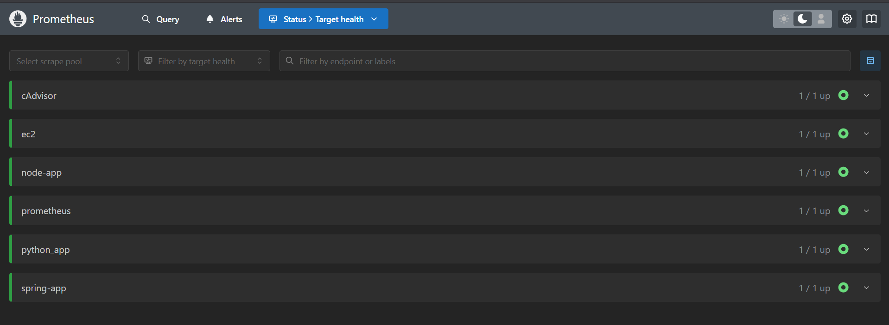

# Prometheus

A hands-on demo repository covering core Prometheus concepts.

---

## What's Covered

| # | Topic | Description |
|---|-------|-------------|
| 1 | **Container Setup** | Run Prometheus via Docker Compose with a persistent volume |
| 2 | **Basic Configuration** | Static scrape targets with custom intervals (`prometheus.yml`) |
| 3 | **Python App Monitoring** | Flask app instrumented with `prometheus_client` (Counter metric) |
| 4 | **NodeJs App Monitoring** | Node app instrumented with `prometheus_client` (Counter metric) |
| 5 | **Java App Monitoring** | Spring Boot app with Micrometer + Actuator exposing `/actuator/prometheus` |
---

## Repository Structure

```
prometheus-iti/
├── docker-compose.yml           # Docker Compose for running Prometheus
├── prometheus.yml         # Scrape config (static)
├── prometheus.service         # Prometheus System Service
├── node_exporter.service         # Node Exporter ometheus System Service
├── python/
│   ├── app.py             # Flask app exposing /metrics endpoint
│   └── requirements.txt   # Python dependencies
├── java/
│   ├── Dockerfile         # eclipse-temurin:17-jre image
│   ├── pom.xml            # Spring Boot + Micrometer dependencies
│   └── src/               # Spring Boot source code
├── nodejs/
│   ├── index.js            # Node app
│   └── index.html
```

---

## Quick Start

### 1. Install Prometheus and Node Exporter from doc.

Precompiled binaries for released versions are available in the [download section](https://prometheus.io/download/).oUsing the latest production release binary is the recommended way to install Prometheus. See the [Installing](https://prometheus.io/docs/prometheus/latest/installation/) chapter in the documentation for all the details.

### 2. Run Prometheus

1- Add `prometheus.service` and `node_exporter.service` to system services
```bash
mv prometheus.service /etc/systemd/system/prometheus.service
mv node_exporter.service /etc/systemd/system/node_exporter.service
systemctl start prometheus.service
systemctl start node_exporter.service
```

Prometheus will be available at **http://localhost:8082**

---

### 3. Run the Python App

```bash
cd python
python -m venv venv
pip install -r requirements.txt
python app.py
```

The app exposes:
- `GET /` — increments the `app_requests_total` counter
- `GET /metrics` — Prometheus-formatted metrics endpoint

---

### 4. Run the Java App

```bash
cd java
docker build -t spring-prometheus-demo .
docker run -p 6666:6666 spring-prometheus-demo
```

```bash
cd java
java -jar java/target/spring-prometheus-demo-1.0.jar
```

The app exposes:
- `GET /` — returns a test response
- `GET /actuator/prometheus` — Prometheus metrics endpoint (via Micrometer)

---

### 5. Run the NodeJs App

```bash
cd nodejs
npm install
node injex.js
```

The app exposes:
- `GET /` — increments the `app_requests_total` counter
- `GET /metrics` — Prometheus-formatted metrics endpoint

## Scrape Configuration Overview

| Job | Target | Path | Interval |
|-----|--------|------|----------|
| `prometheus` | `localhost:8082` | `/metrics` | 15s (global) |
| `cAdvisor`   | `localhost:8089` | `/metrics` |
| `python_app` | `192.168.159.135:5000` | `/metrics` |
| `spring-app` | `192.168.159.135:6666` | `/actuator/prometheus` |
| `node-app` | `192.168.159.135:8000` | `/metrics` |
| `ec2` | EC2 instances (eu-noth-1, port 9100) | `/metrics` |

---


## Final Results



---

## Prerequisites

- Docker & Docker Compose
- Python 3.x
- Node 20.x+
- Java 17+ / Maven (for building the Java app locally)
- Node Exporter running on target EC2 instances (port 9100)